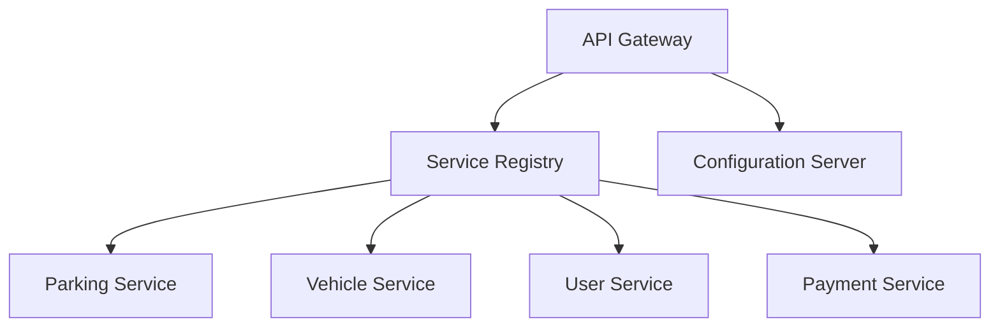
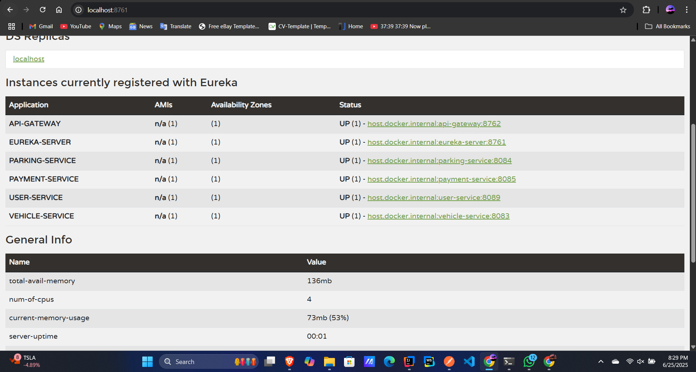

# 🚗 Smart Parking Management System (SPMS)
> *Revolutionizing Urban Mobility Through Intelligent Microservices*

<div align="center">


*Transforming chaotic urban parking into seamless digital experiences*

</div>

---

## 🌟 **Vision Statement**

In the heart of bustling metropolitan landscapes, where every minute counts and every parking spot is precious, SPMS emerges as the ultimate solution to urban mobility challenges. We're not just building software—we're crafting the future of smart cities.

## 🚨 **The Urban Crisis We're Solving**

Picture this: millions of drivers circling city blocks, burning fuel, losing time, and contributing to environmental degradation—all in search of a simple parking space. This isn't just inconvenience; it's a crisis that demands innovation.

### 💔 **The Pain Points**
- **🚦 Traffic Nightmares**: Endless queues and congestion choking city arteries
- **⛽ Resource Waste**: Precious fuel burned in futile parking searches
- **🌍 Environmental Impact**: Rising greenhouse emissions from idle vehicles
- **😤 Human Frustration**: Stressed drivers and reduced quality of life
- **💼 Economic Loss**: Businesses losing customers due to parking barriers

## 🚀 **Our Revolutionary Solution**

SPMS transforms urban parking from a daily struggle into an effortless digital experience. Built on cutting-edge microservice architecture, our platform delivers:

### ✨ **Core Innovations**
- 🔄 **Real-Time Intelligence**: Dynamic space allocation with instant updates
- 🌐 **IoT Integration**: Seamless connectivity with smart city infrastructure  
- 💳 **Digital-First Experience**: Contactless payments and instant receipts
- 🏗️ **Future-Proof Architecture**: Scalable microservices for growing cities
- 📱 **User-Centric Design**: Intuitive interfaces for all stakeholders

## 👥 **Empowering Three Key Communities**

<table>
<tr>
<th>🚗 Drivers</th>
<th>🏢 Parking Owners</th>
<th>💰 Payment Partners</th>
</tr>
<tr>
<td>
• Find & reserve spots instantly<br>
• Navigate directly to available spaces<br>
• Pay seamlessly without hassle<br>
• Access complete booking history
</td>
<td>
• Monitor spaces in real-time<br>
• Optimize pricing dynamically<br>
• Maximize revenue potential<br>
• Gain powerful analytics insights
</td>
<td>
• Process secure transactions<br>
• Generate digital receipts<br>
• Ensure compliance & security<br>
• Enable frictionless payments
</td>
</tr>
</table>

## 🎯 **Strategic Objectives**

Our mission extends beyond mere parking management—we're building the foundation for smarter, more sustainable cities:

- 🔍 **Instant Discovery**: Real-time parking search and reservation
- 📊 **Dynamic Management**: Intelligent space allocation and monitoring
- 📈 **Data-Driven Insights**: Comprehensive usage analytics and reporting
- 🚙 **Seamless Operations**: Automated vehicle entry and exit simulation
- 🔐 **Secure Transactions**: Robust payment processing with digital receipts
- 📜 **Complete Traceability**: Detailed historical logs and audit trails
- 🌱 **Sustainable Impact**: Reduced congestion and environmental footprint

## 🏗️ **Architectural Excellence**

Our system represents the pinnacle of modern software architecture—a symphony of interconnected microservices working in perfect harmony.

### 🌐 **Infrastructure Foundation**



#### 🔧 **Core Infrastructure**
- **🎯 Service Registry (Eureka)**: The nervous system enabling dynamic service discovery
- **⚙️ Configuration Server**: Centralized brain managing all system configurations
- **🚪 API Gateway**: The elegant front door welcoming all client interactions

#### 💼 **Business Intelligence Services**
- **🅿️ Parking Space Service**: The heart of space management and reservations
- **🚗 Vehicle Service**: Comprehensive vehicle lifecycle management
- **👤 User Service**: Sophisticated user experience and authentication
- **💳 Payment Service**: Secure, reliable financial transaction processing

## 🛠️ **Technology Powerhouse**

<div align="center">

| 🎯 **Technology** | 🌟 **Purpose** | 💪 **Why We Chose It** |
|---|---|---|
| **Spring Boot** | Microservice Foundation | Production-ready, minimal configuration, enterprise-grade |
| **Spring Cloud Eureka** | Service Discovery | Dynamic registration, fault tolerance, scalability |
| **Spring Cloud Config** | Configuration Management | Centralized control, hot reloading, environment flexibility |
| **Spring Cloud Gateway** | API Orchestration | Intelligent routing, load balancing, security integration |
| **Spring Web** | RESTful APIs | Industry standard, robust, well-documented |
| **Node.js + Express** | Lightweight Services | High performance, JavaScript ecosystem, rapid development |
| **Python Flask** | Specialized APIs | Simplicity, flexibility, perfect for specific use cases |
| **Postman** | API Excellence | Comprehensive testing, documentation, team collaboration |

</div>


### 🎬 **Launch Sequence**

#### **Phase 1: Foundation Setup**
```bash
# 🚀 Clone the Future
git clone <repository-url>
cd smart-parking-management-system

# 🎯 Launch Service Registry
cd eureka-server && mvn spring-boot:run
```

#### **Phase 2: Infrastructure Activation**
```bash
# ⚙️ Start Configuration Hub
cd config-server && mvn spring-boot:run

# 🚪 Open the Gateway
cd api-gateway && mvn spring-boot:run
```

#### **Phase 3: Business Services Deployment**
```bash
# 🅿️ Parking Intelligence
cd parking-space-service && mvn spring-boot:run

# 🚗 Vehicle Management
cd vehicle-service && mvn spring-boot:run

# 👤 User Experience
cd user-service && mvn spring-boot:run

# 💳 Payment Processing
cd payment-service && mvn spring-boot:run
```

### 🌐 **Access Points**
- **🎯 Eureka Dashboard**: `http://localhost:8761` - *Your service command center*
- **🚪 API Gateway**: `http://localhost:8080` - *The main entrance to your system*
- **⚙️ Configuration Hub**: `http://localhost:8888` - *Central configuration management*


## 📁 **Project Architecture**

```
🏗️ smart-parking-management-system/
├── 🎯 eureka-server/                 # Service Discovery Hub
├── ⚙️ config-server/                # Configuration Command Center
├── 🚪 api-gateway/                   # System Entry Point
├── 🅿️ parking-space-service/         # Parking Intelligence Engine
├── 🚗 vehicle-service/               # Vehicle Management System
├── 👤 user-service/                  # User Experience Platform
├── 💳 payment-service/               # Financial Processing Unit
├── 📚 docs/
│   └── 📸 screenshots/               # Visual Documentation
├── 🧪 postman_collection.json       # API Testing Arsenal
└── 📖 README.md                      # Project Bible
```

## 📋 **Resources & Documentation**

<div align="center">

### 🔗 **Essential Links**
- **[🧪 Postman Collection](./postman_collection.json)** - *Your complete API testing toolkit*
- **** - *Service registry visualization*

</div>


<div align="center">

**🌟 Built with Passion • Designed for Impact • Engineered for Excellence 🌟**

*Transforming Urban Mobility, One Parking Space at a Time*

**[⭐ Star this repository if you found it helpful!]()**

</div>

---

*This project showcases the power of microservice architecture in solving real-world urban challenges, combining cutting-edge technology with user-centric design to create truly impactful smart city solutions.*
